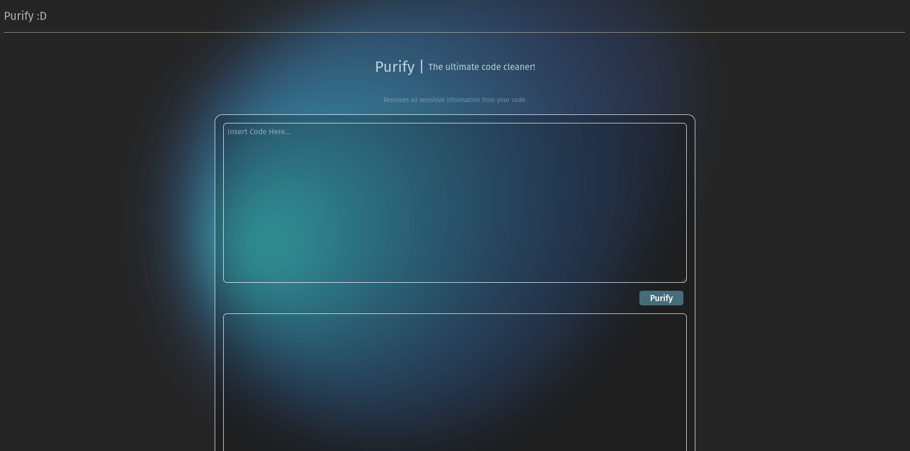

# Code Purifier
Code Purifier is a web application designed to remove sensitive information from your code. It ensures that your code is clean and free from any personal or sensitive data before sharing or deploying.

## Features

- **Sensitive Information Removal**: Automatically detects and removes sensitive information such as API keys, access tokens, usernames, passwords, and more.
- **User-Friendly Interface**: Simple and intuitive interface for easy code input and output.
- **Quick Processing**: Fast purification of code with real-time feedback.

## Getting Started

Follow these instructions to set up and run Code Purifier on your local machine.

### Prerequisites

- Node.js (v16 or higher)
- npm (v7 or higher)

### Installation

1. Clone the repository:
    ```sh
    git clone https://github.com/yourusername/code-purifier.git
    cd code-purifier
    ```

2. Install the dependencies:
    ```sh
    npm install
    ```

### Running the Application

1. Start the development server:
    ```sh
    npm run dev
    ```

2. Open your browser and navigate to `http://localhost:3000` to access the application.

### Building for Production

To build the application for production, run:
```sh
npm run build
```

### Previewing the Production Build

To preview the production build, run:
```sh
npm run preview
```

## Scripts

- `npm run dev`: Starts the development server.
- `npm run build`: Builds the application for production.
- `npm run preview`: Previews the production build.
- `npm run format`: Formats the code using Prettier.
- `npm run lint`: Lints the code using ESLint and Prettier.

## Contributing

Contributions are welcome! Please open an issue or submit a pull request for any improvements or bug fixes.

## License

This project is licensed under the MIT License.
---
*This README was generated with AI assistance However no code was created with AI assistance.*
Made with ❤️ by Max